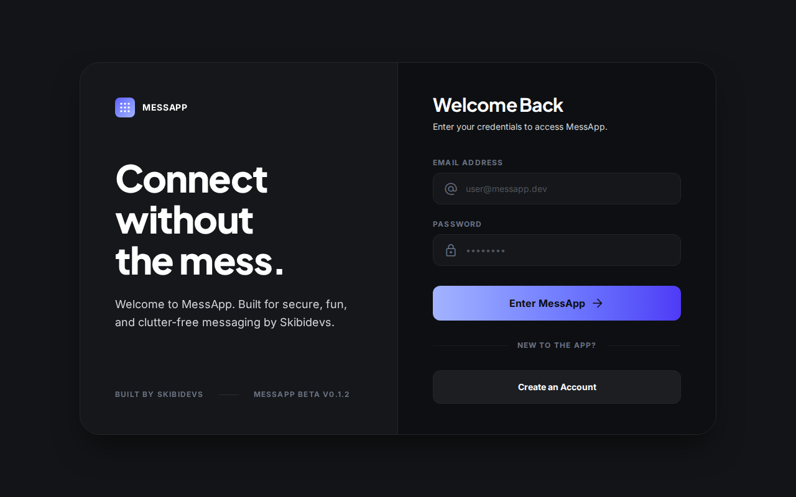
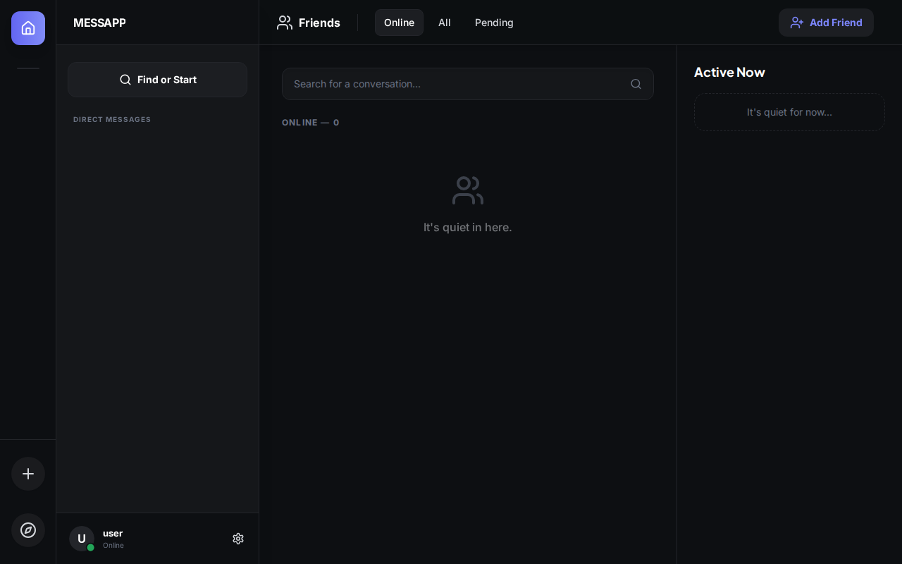
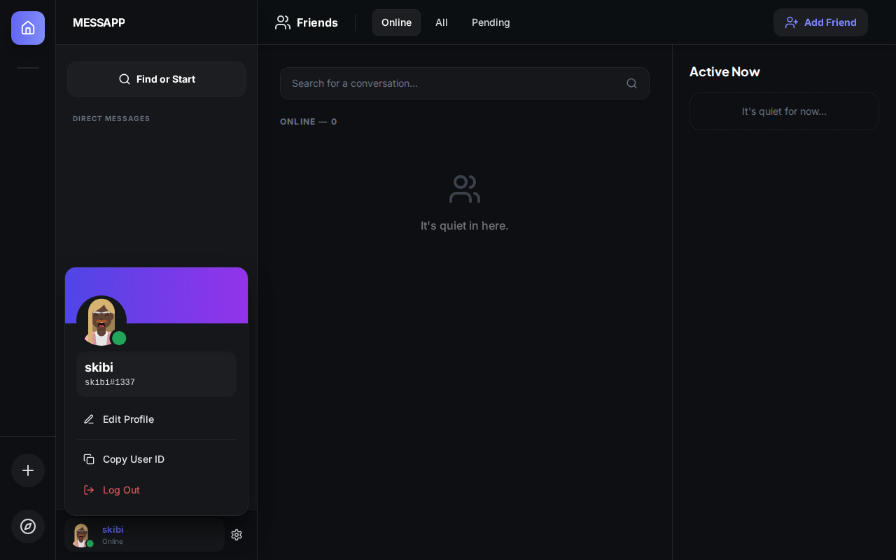
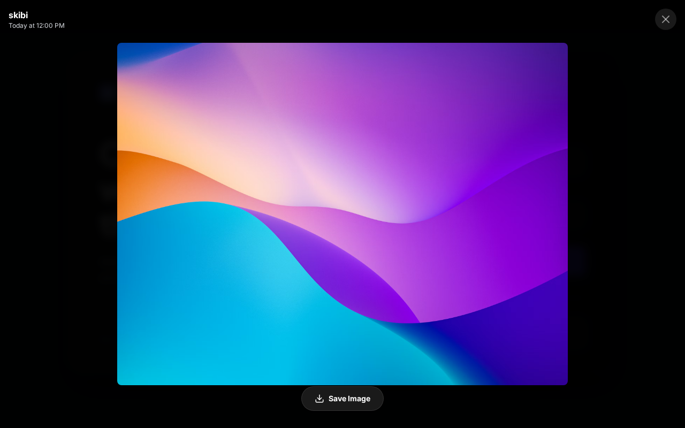
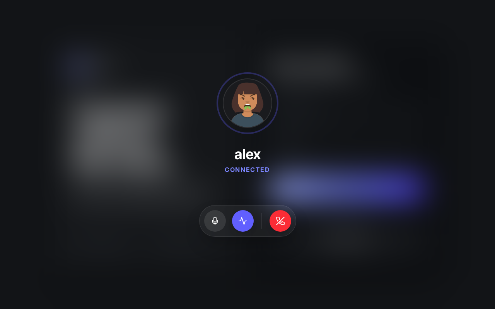
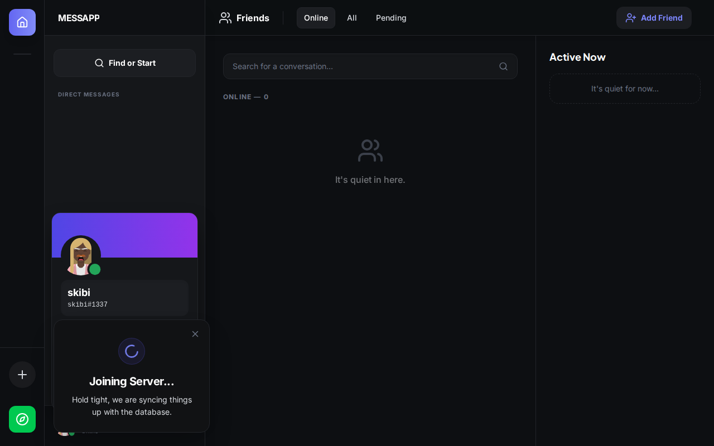
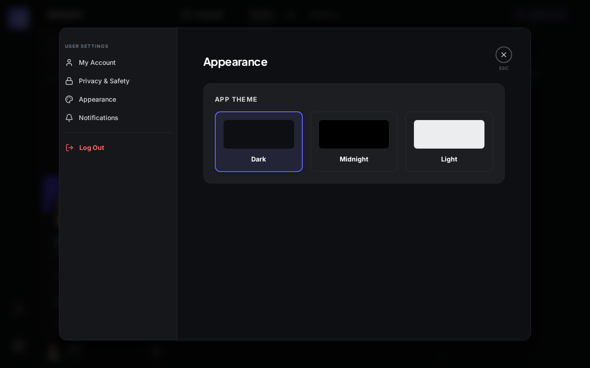

````markdown
<div align="center">

# 🚀 MessApp

**ONE MESS AT A TIME**

*A secure, real-time messaging platform designed to keep users connected seamlessly across Web, Android, and Linux environments.*

[](https://github.com/messapp/messapp)
[](https://github.com/messapp/messapp/blob/main/LICENSE)
[](https://react.dev/)
[](https://tailwindcss.com/)
[](https://supabase.com/)

</div>

---

## 📸 Screenshots

### Core Features

| Login / Onboarding | Dashboard / Chat Interface |
|:---:|:---:|
|  |  |

| User Profile & Settings | Media & Lightbox |
|:---:|:---:|
|  |  |

### Ongoing Features & Development

| P2P Voice Calling (WIP) | Server Architecture (WIP) |
|:---:|:---:|
|  |  |

### App Settings
<p align="center">
  
</p>

---

## ✨ Core Features

* **Military-Grade Privacy:** True End-to-End Encryption (AES-GCM) with 6-digit PIN PBKDF2 secure cloud vaulting. Even the database admins cannot read your messages.
* **Vaporize Messages:** "Unsend" performs a true database hard-delete, leaving no trace behind. You can also permanently vaporize entire conversations.
* **Real-Time Synchronization:** Instant message delivery and live state updates powered by Supabase Realtime.
* **Cross-Platform Access:** A unified experience whether accessing the live web deployment or using the native "headless" builds for Linux (Tauri) and Android (Capacitor).
* **Rich Messaging:** Markdown rendering, syntax highlighting for code blocks, and dynamic Microlink URL unfurling.
* **User Customization:** Comprehensive profile management and UI theme color persistence.

---

## 🛠️ Technology Stack

* **Frontend:** React 19 + Vite 6
* **Styling:** Tailwind CSS v4 (Semantic design system with `@theme`)
* **Backend & Database:** Supabase (Postgres, Auth, Realtime, Storage)
* **Native Wrappers:** Capacitor (Android) and Tauri (Linux)
* **Testing:** Vitest + React Testing Library

---

## 🚀 Getting Started

Follow these steps to set up the development environment on your local machine.

### Prerequisites

* Node.js v22.22.1 or newer
* npm (Node Package Manager)
* A Supabase project

### Installation

1. **Clone the repository:**
   ```bash
   git clone [https://github.com/messapp/messapp.git](https://github.com/messapp/messapp.git)
   cd messapp
````

2.  **Install dependencies:**

    ```bash
    npm install
    ```

3.  **Configure Environment Variables:**
    Create a `.env` file in the root directory and add your Supabase credentials along with your Giphy API key:

    ```env
    VITE_SUPABASE_URL=your_supabase_project_url
    VITE_SUPABASE_ANON_KEY=your_supabase_anon_key
    VITE_GIPHY_API_KEY=your_giphy_api_key
    ```

    *(Note: Never commit local `.env` files to version control.)*

4.  **Start the Development Server:**

    ```bash
    npm run dev
    ```

    The application will be available at `http://localhost:5173`.

-----

## 🧭 System Architecture

The application is highly modularized to handle complex state and real-time events efficiently:

  * **Authentication Engine:** Centralized routing and deep-link session handling within `App.jsx`.
  * **Dashboard Interface:** The primary command center driving the chat UI, real-time subscriptions, and message history (`Dashboard.jsx`).
  * **Modular Interface System:** Dedicated modal components for managing Server creation, Channel configurations, and User preferences.

For a deeper dive into the data flow, database schema blueprint, and development architecture, please refer to our [System Documentation](https://www.google.com/search?q=./SYSTEM_DOCUMENTATION.md).

-----

## 🗺️ Roadmap

**Current Version:** `v0.1.3-beta0`

### Phase 1: Foundation (Completed)

  - [x] Cross-platform build architecture (Web, Android APK, Linux .deb/.AppImage)
  - [x] Deep-linked email authentication
  - [x] Direct Messaging Architecture
  - [x] Secure local storage management and cache pruning
  - [x] Supabase Auth, Realtime, and Storage Integration

### Phase 2: Rich Features & Optimization (Current)

  - [x] Media upload and optimization pipeline (`browser-image-compression`)
  - [x] In-app media lightbox viewer
  - [x] P2P signaling via Supabase Channels (WebRTC Foundation)
  - [ ] Push notifications
  - [ ] Hardware-accelerated voice and video calls
  - [ ] Server Architecture implementation (Channels, Moderation)
  - [ ] Desktop notifications & Native mobile overlays

### Phase 3: Privacy & Security

  - [x] End-to-End Encryption (E2EE) using `crypto.subtle`
  - [x] Local encrypted message vaults with PBKDF2 secure PIN syncing
  - [x] True database Hard Deletion for messages and rooms
  - [ ] Double Ratchet algorithm for perfect forward secrecy

-----

## 💖 Support the Project

MessApp is an open-source passion project built by a solo indie developer (Skibidevs). I got tired of bloated chat apps tracking my data, so I built a clean, glassmorphic alternative.

If you love the aesthetic, appreciate the absolute focus on privacy, or just want to support the development of Phase 3, consider leaving a tip\! Your donations help keep the servers running and the coffee flowing.

  * ☕ **[Buy me a Coffee (Ko-fi)](https://www.google.com/search?q=%23)** *(Replace with your link)*
  * 💖 **[Sponsor me on GitHub](https://www.google.com/search?q=%23)** *(Replace with your link)*
  * 💰 **Crypto (BTC):** `your_bitcoin_wallet_address_here`
  * 💎 **Crypto (ETH):** `your_ethereum_wallet_address_here`

-----

## 🤝 Contributing

We welcome contributions\! Please follow our established style guidelines and feature branch conventions (e.g., `feature/awesome-feature` or `fix/annoying-bug`).

Ensure you run tests and linters before submitting a Pull Request:

```bash
npm run test
npm run lint
```

*MessApp is proudly built for communities, one mess at a time.*

```

*(Be sure to replace the `#` and `your_bitcoin_wallet_address_here` placeholders in the "Support the Project" section with your actual donation links!)*
```
